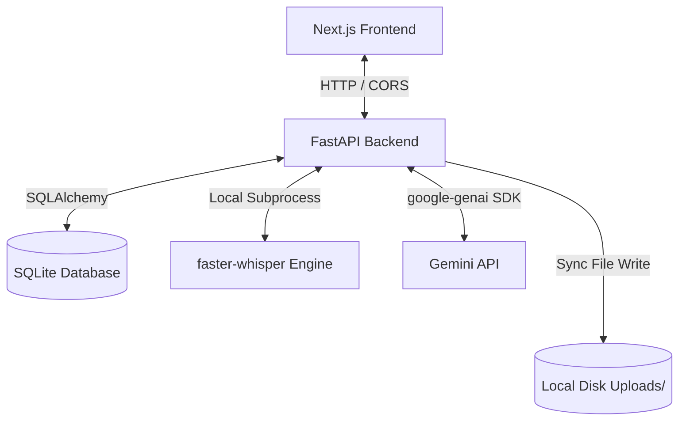

# Architecture Review: Meeting-AI

This document provides a comprehensive evaluation of the Meeting-AI system architecture, code quality, and production readiness from the perspective of a production-grade AI meeting assistant (similar to Fireflies.ai, Otter.ai, Granola, and Otter).

---

## 1. Architectural Components

### Backend (FastAPI)
* **Current State**: Monolithic, synchronous-leaning framework. API endpoints handle requests and run backend transcription routines.
* **Bottlenecks**: FastAPI manages asynchronous HTTP requests efficiently, but transcription (Whisper) and summarization (Gemini) are resource-intensive tasks. Running transcription locally on the server via `BackgroundTasks` blocks CPU cores and limits API concurrency. If a server process crashes, all active background tasks are lost permanently without recovery options.
* **Recommendations**: Migrate to a decoupled worker architecture using a distributed task queue (e.g., Celery or RQ) backed by Redis/RabbitMQ.

### Frontend (Next.js)
* **Current State**: Client-side rendered main route (`app/page.tsx`) with basic React hooks.
* **Bottlenecks**: State is managed locally inside a single component. The frontend relies on polling or static state rendering, which makes real-time status updates hard to track.
* **Recommendations**: Implement a global state store (e.g., Zustand) and transition status tracking to Server-Sent Events (SSE) or WebSockets instead of static polling.

### Database (SQLite)
* **Current State**: Local SQLite file database (`meeting_ai.db`) managed via SQLAlchemy ORM.
* **Bottlenecks**: SQLite has a single-writer constraint. Under concurrent multi-user environments with multiple audio uploads occurring simultaneously, write locks will cause transaction timeouts and crash requests. There is also no schema migration framework (e.g., Alembic).
* **Recommendations**: Migrate to PostgreSQL for concurrent transactional workloads and initialize Alembic to manage database schema revisions.

### AI Pipeline
* **Current State**: Local Whisper transcription (`faster-whisper`) combined with external Gemini summarization (`google-genai`).
* **Bottlenecks**: Audio is transcribed locally in CPU-bound sub-threads, which degrades API response times. Summarization makes synchronous network calls to the Gemini API which are susceptible to API timeouts and 429 rate limits.
* **Recommendations**: Move transcription to dedicated GPU workers (or a managed API like Deepgram). Implement circuit breakers, fallback models, and exponential backoff retries for the Gemini API.

### File Storage
* **Current State**: Local filesystem writes under the backend folder (`uploads/`).
* **Bottlenecks**: Storing large media uploads on server disks is non-scalable, expensive, and prevents stateless server autoscaling (Kubernetes/ECS).
* **Recommendations**: Migrate audio storage to cloud object storage (e.g., AWS S3, Google Cloud Storage) using presigned URLs for client uploads to bypass the backend entirely.

### API Design
* **Current State**: CRUD REST endpoints.
* **Bottlenecks**: Lacks authentication, rate limiting, and webhook support for third-party integrations (Slack, Notion).
* **Recommendations**: Implement OAuth2/JWT security layers, enforce API rate limits, and design Webhook push integrations.

---

## 2. Code Quality & Technical Debt

### Maintainability
* **Strengths**: The separation between services (`transcription.py`, `ai_summary.py`, `pdf_generator.py`) and routes is clear.
* **Weaknesses**: Configuration settings are partially loaded loosely; a fully validated config system using Pydantic Settings is recommended.

### Scalability
* **Rating**: **Low**. CPU-bound transcription on the API host limits vertical scaling. The system cannot scale horizontally because state is tied to local storage and SQLite.

### Security
* **No Authentication**: The application has no user accounts or permission layers; all users share the same database and upload history.
* **Open CORS**: `allow_origins=["*"]` is configured, exposing endpoints to cross-origin exploits in production.
* **No Input Validation**: Uploaded file types are not sanitized, posing remote code execution (RCE) and denial of service (DoS) risks from oversized files.

### Performance
* **Mac CPU Constraints**: Local Whisper models take approximately 0.5x of the audio's duration to process on standard CPU clusters.
* **No Cache Layer**: Frequently accessed summaries and listing requests hit the database directly without caching (e.g., Redis).

---

## 3. Production Readiness Matrix

| Area | Status | Gaps | Recommendation |
| :--- | :---: | :--- | :--- |
| **Logging** | **Gapped** | Output uses standard stdout prints without tracking context. | Integrate structured JSON logging (e.g., `structlog`) with transaction tracking IDs. |
| **Monitoring**| **None** | No APM, health check endpoints (except simple ping), or CPU/memory telemetry. | Export Prometheus metrics; set up Sentry for error tracking. |
| **Error Recovery**| **Gapped** | Failed API summarization commits a `"failed"` status, but provides no recovery or retry route. | Implement a retry scheduler for failed summarizations. |
| **Background Processing** | **Gapped** | Relies on internal thread execution pools on the web server. | Decouple workers using Celery and Redis. |
| **Test Coverage** | **Good** | Good E2E and unit test coverage, but lacks concurrency and load testing. | Add K6 or Locust performance scripts. |
| **CI/CD** | **Gapped** | Untracked config files exist locally; pipeline is not yet tested in production environment. | Enable CI pipeline in GitHub Actions with automated dockerized builds. |

---

## 4. Product Comparison & Market Positioning

Comparing **Meeting-AI** to leading tools: **Otter.ai**, **Fireflies.ai**, **Granola**, and **Plaud.app**.

### Competitive Advantages
1. **Data Sovereignty**: Local Whisper execution ensures confidential data does not leave the corporate boundary (except for summarization, which can be routed to a secure private LLM proxy).
2. **Deterministic PDF Notes**: High-fidelity, localized PDF summaries with zero promotional branding, ideal for formal internal reporting.

### Core Feature Gaps
1. **Speaker Diarization**: Otter/Fireflies tell you *who* said *what*. Currently, Meeting-AI outputs a single block of un-attributed text.
2. **Live Recording Integration**: Fireflies uses calendar-bot integration to auto-join Zoom/Teams/Meet. Meeting-AI requires manual recording or audio file uploading.
3. **Interactive Document Editor**: Granola allows you to edit generated meeting notes while keeping them linked to the exact audio timeline. Meeting-AI has static read-only views.
4. **Keyword Search**: No cross-meeting keyword search or semantic retrieval (RAG) across the history of meeting notes.
