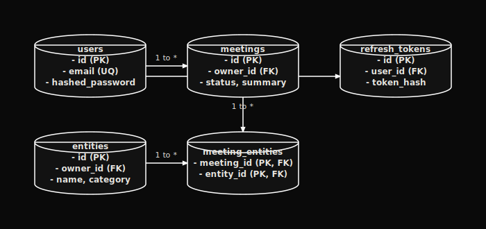

# Backend Database Schema (BACKEND_SCHEMA) — Orivon

This document describes the database schema, table columns, constraints, and relationships used by the **Orivon** FastAPI backend.

---

---

## 2. Table Schemas

### 1. `users` Table
Stores user accounts. Supports standard email/password accounts and Google Identity logins.

| Column Name | Type | Constraints | Purpose |
| :--- | :--- | :--- | :--- |
| `id` | Integer | Primary Key, Auto-increment | Unique identifier. |
| `email` | String | Unique Index, Not Null | User email address. |
| `hashed_password` | String | Nullable | BCrypt hash of password (null for Google-only users). |
| `google_id` | String | Unique Index, Nullable | Google profile ID for OAuth sign-in. |
| `name` | String | Nullable | User display name. |
| `created_at` | DateTime | Not Null (UTC Default) | Account creation timestamp. |

---

### 2. `refresh_tokens` Table
Manages active user login sessions. Validates refresh cookie calls securely on restart.

| Column Name | Type | Constraints | Purpose |
| :--- | :--- | :--- | :--- |
| `id` | Integer | Primary Key | Token identifier. |
| `user_id` | Integer | ForeignKey(`users.id`), Not Null | Account session owner. |
| `token_hash` | String | Unique Index, Not Null | SHA-256 hash of the issued refresh token. |
| `expires_at` | DateTime | Not Null | Token expiration timestamp. |
| `revoked_at` | DateTime | Nullable | Timestamp if session was manually logged out. |
| `created_at` | DateTime | Default (UTC) | Token creation timestamp. |

---

### 3. `meetings` Table
Stores uploaded audio metadata, transcription text, and Gemini-generated structured summaries.

| Column Name | Type | Constraints | Purpose |
| :--- | :--- | :--- | :--- |
| `id` | Integer | Primary Key | Meeting identifier. |
| `owner_id` | Integer | ForeignKey(`users.id`), Nullable | Tenant owner. |
| `title` | String | Default: `"Untitled Meeting"` | Title of the meeting. |
| `audio_path` | String | Not Null | Path to the saved raw audio file. |
| `transcript` | Text | Nullable | Raw Whisper speech-to-text transcript. |
| `summary` | Text | Nullable | Gemini executive summary paragraph. |
| `key_points` | Text | Nullable (JSON String) | List of key summary bullet points. |
| `decisions` | Text | Nullable (JSON String) | List of extracted meeting decisions. |
| `action_items` | Text | Nullable (JSON String) | List of tasks, deadlines, and owners. |
| `status` | String | Default: `"uploaded"` | Processing state: `uploaded` $\rightarrow$ `transcribing` $\rightarrow$ `summarizing` $\rightarrow$ `done` $\rightarrow$ `failed`. |
| `recording_type` | String | Default: `"Unknown"` | Class category (e.g. Standup, Lecture). |
| `confidence` | Integer | Default: `100` | Percentage reliability rating of summary. |
| `created_at` | DateTime | Default (UTC) | Meeting upload timestamp. |

---

### 4. `entities` Table
Stores unique extracted tag nodes (People, Projects, Topics) to build the semantic Orivon memory graph.

| Column Name | Type | Constraints | Purpose |
| :--- | :--- | :--- | :--- |
| `id` | Integer | Primary Key | Tag identifier. |
| `owner_id` | Integer | ForeignKey(`users.id`), Nullable | Account boundary owner. |
| `name` | String | Not Null, Index | Text label of entity (e.g. "Alice"). |
| `category` | String | Not Null | Tag category (e.g. `people`, `projects`, `topics`). |

*   **Unique Constraint**: `uq_entity_name_category_owner` ensures name + category + owner combinations are not duplicated across the user space.

---

### 5. `meeting_entities` Table
Join table mapping relational tags to specific meetings with contextual excerpts.

| Column Name | Type | Constraints | Purpose |
| :--- | :--- | :--- | :--- |
| `meeting_id` | Integer | Primary Key, ForeignKey(`meetings.id`) | Mapped meeting. |
| `entity_id` | Integer | Primary Key, ForeignKey(`entities.id`) | Mapped tag. |
| `context` | Text | Nullable | Sub-excerpt showing where the entity was mentioned. |
