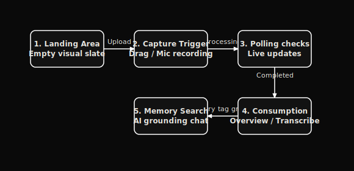

# Product Requirements Document (PRD) — Orivon

**Orivon** is a premium, open-source AI meeting workspace that turns raw human conversation into structured, permanent, and linked knowledge. 

---

## 1. Product Vision & Principles

### Vision
To turn raw human conversation into structured, searchable, and permanent intelligence. A world where no idea is lost, no decision is forgotten, and raw voice transforms into a structured personal knowledge network.

### Positioning
Orivon is **NOT** a recording app or a transcription dashboard. It is an **AI Knowledge Workspace**. We do not focus on "audio playback" as the primary utility; we focus on the **Knowledge Graph** and **Semantic Search** derived from conversation.

### Core Principles
*   **Orivon IS**: A permanent memory assistant; an editorial document workspace; a precision tool.
*   **Orivon is NOT**: A chat toy; a media file catalog; a cluttered dashboard.
*   **Quiet**: Non-intrusive. Never sends unnecessary alerts or uses neon glows.
*   **Precise**: High attention to details, sub-pixel borders, alignment, and semantic layout.
*   **Academic**: Editorial, focused on reading comprehension, clarity, and structured indexing.

---

## 2. User Journey & Personas

### Personas
1.  **Product & Engineering Leaders**: Who need decision tracking and action summaries across multiple standups and planning sessions.
2.  **Researchers & Consultants**: Syncing interview notes, coding observations, and mapping concepts.
3.  **Students & Academics**: Converting complex lectures into study structures.

### The Journey
1.  **First Launch**: Instantly greets users with a clean, empty state with minimal visual distraction, offering live recording (microphone) or drag-and-drop file upload.
2.  **Capture Flow**: Visual focus shifts into a high-fidelity visualizer (mic-level feedback, timer) without leaving the context sheet.
3.  **Processing**: Instantly triggers progress timelines: Upload -> Speech recognition -> Summary creation -> Topic extraction -> Memory graph indexing.
4.  **Consumption**: The user reads an editorial, publication-grade document layout split into: Overview (summary, action items), Transcript, and Memory.
5.  **Memory Mapping**: Extracted tags (people, projects, topics) link the recording automatically to other meetings containing matching entities.
6.  **Querying**: Users type into the search bar or chat assistant. The scope is either local (per-recording) or global (cross-recording memory graph queries).

---

## 3. Core Functional Capabilities

-   **Seamless Recording & Upload**: Support browser media recording and fast file drops (`.mp3`, `.wav`, `.m4a`, etc.).
-   **Structured Analysis**: AI-generated titles, editorial summaries, bulleted key points, decisions, and action items.
-   **Authentication & Multi-Tenancy**: Complete registration and login system with JWT tokens, Google Sign-In support, secure sessions, and strict data isolation across accounts.
-   **Orivon AI Assistant Panel**: Persistent chat helper that answers questions using the meeting context, drafts email follow-ups, exports PDFs, and routes queries globally when no specific meeting is selected.
-   **Knowledge Graph (Memory)**: Extracting entities (people, projects, topics) and creating relational connections between meetings.
-   **Keyboard Shortcuts**: High-speed productivity shortcuts (e.g., Space to play/pause, Arrow keys to skip, ⌘K focus search) to minimize click overhead.

---

## 4. Product Metric Goals

*   **Time-to-Value (TTV)**: Under 10 seconds to upload/record a meeting.
*   **Note Quality**: Structured summaries must be editorial and actionable, keeping markdown tables clean.
*   **Privacy & Control**: Direct on-disk offline whisper transcription option.
