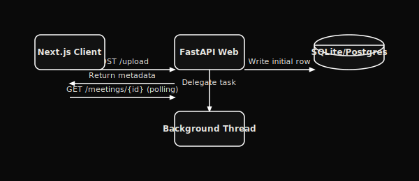

# Technical Requirements Document (TRD) — Orivon

This document defines the technical architecture, application stack, API routes, and operational layout of the **Orivon** workspace.

---

---

## 2. Technology Stack

### Frontend
*   **Framework**: Next.js 16 (Turbopack, Tailwind CSS v4, TypeScript, React 19)
*   **Visual Elements**: Lucide Icons, Custom CSS scrollbars, responsive Flexbox rail layout.
*   **Authentication State**: In-memory token storage (XSS protected) backed by HttpOnly secure cookies.

### Backend
*   **Framework**: FastAPI (Uvicorn HTTP server)
*   **Database ORM**: SQLAlchemy 2.0 (configured with SQLite by default; Postgres driver ready)
*   **Speech-to-Text**: local `faster-whisper` (transcription engine running on disk)
*   **Summarization & AI**: `google-genai` Python SDK calling `gemini-3.1-flash-lite`

---

## 3. Core API Endpoint Specs

### Authentication
*   `POST /auth/register` - Create email/password user account.
*   `POST /auth/login` - Authenticate credentials and return JWT token + HttpOnly cookie.
*   `POST /auth/logout` - Revoke refresh token and wipe session.
*   `POST /auth/refresh` - Swap active refresh cookie for a fresh access token.
*   `POST /auth/google` - Sign in/Up via Google token validation.
*   `POST /auth/change-password` - Update account password.

### Meetings
*   `POST /meetings/upload` - Accept multipart audio upload, start background transcription thread, return instant metadata in `uploaded` status.
*   `GET /meetings` - List paginated meetings belonging to the authenticated tenant.
*   `GET /meetings/{id}` - Fetch details of a single meeting (summary, transcript, action items).
*   `DELETE /meetings/{id}` - Purge record audio, transcripts, and related graph connections.
*   `POST /meetings/{id}/regenerate` - Re-execute Gemini summarization on the existing transcript.
*   `GET /meetings/{id}/export/pdf` - Generate and download localized PDF summarizing the meeting.

### AI Chat & Memory
*   `POST /meetings/{id}/chat` - Submit a prompt grounded in the single meeting context.
*   `POST /meetings/global/chat` - Submit a prompt grounded across the user's entire historical meeting database.
*   `GET /meetings/{id}/metadata` - Fetch tags, entity list, and related meeting recommendations.

---

## 4. Background Job Processing (Phase 2 Setup)

Rather than executing transcription synchronously during the upload API request, Orivon decouples heavy computing tasks off the web thread:
1.  **Instant Return**: `POST /meetings/upload` writes the audio to disk, creates the database record with a `transcribing` status, and returns control to the frontend.
2.  **Starlette BackgroundTasks**: Starts a background worker pipeline `process_meeting(meeting_id)`.
3.  **Terminal Updating**: The thread transcribes the audio, calls Gemini to summarize the text, extracts context entities, and changes status to `done` (or `failed` if an error occurs).
4.  **Frontend Polling**: The frontend client checks the progress via `GET /meetings/{id}` until the terminal state is reached.

---

## 5. Security Guardrails

*   **Tenant Isolation**: All queries filter by `owner_id` derived from the decoded JWT token.
*   **Startup Validation**: Config checker checks environment files on boot to prevent server starts with invalid configurations.
*   **Rate Limits**: Endpoint-specific rate limitations throttle abuse patterns.
*   **Secure Cookies**: Enforces HTTPOnly session states to prevent client script attacks.
