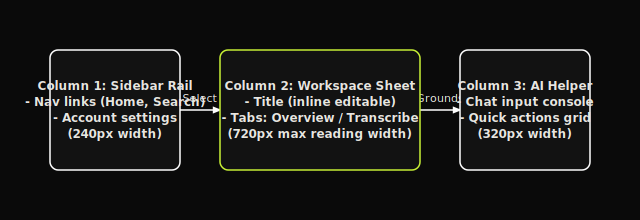

# UI/UX Brief & Design System — Orivon

Orivon is styled under a custom, publication-grade **Graphite Dark Theme**. This document specifies the colors, typography, spacing, components, and design rules that ensure the interface remains calm, readable, and premium.

---

## 1. Brand Identity & Personality

*   **Quiet**: Minimal distractions. No notifications, glowing icons, or animated cartoon avatars.
*   **Precise**: Heavy reliance on thin borders (`1px`), clean grid margins, and aligned text layers.
*   **Academic / Editorial**: The primary reading sheet resembles a high-end publication column, optimized for high comprehension and low cognitive load.

---

## 2. Color System

The system is strictly dark mode by default, utilizing a graphite gray scale to prevent eye strain.

```
Base Background   : #0A0A0A (Rich pure off-black)
Surface / Inputs  : #121212 (Dark charcoal)
Elevated Surfaces : #1A1A1A (Graphite gray)
Hover / Active    : rgba(255, 255, 255, 0.05)
```

### Borders
-   `Border Subtle`: `rgba(255, 255, 255, 0.06)`
-   `Border Mid`: `rgba(255, 255, 255, 0.12)`
-   `Border Strong`: `rgba(255, 255, 255, 0.20)`

### Typography Colors
-   `Primary Text`: `#E8E6E1` (Warm off-white)
-   `Secondary Text`: `#C4C0B8` (Soft gray)
-   `Muted / Disabled`: `#6B6660` (Graphite gray)

### The Accent (Acid Lime)
-   **Hex Value**: `#C8F135`
-   **Usage Constraint**: Must never exceed **1.5%** of the screen real estate. Reserved strictly for active indicators:
    *   Audio playback track progress
    *   Left rail active navigation dot
    *   Pulsing recording ring
    *   Chat input focus borders

---

## 3. Typographic Scale

| Style | Font | Weight | Size | Line Height | Tracking | Usage |
| :--- | :--- | :--- | :--- | :--- | :--- | :--- |
| **Title 1** | Inter | 700 (Bold) | `28px` | `1.2` | `-0.04em` | Recording Titles |
| **Title 2** | Inter | 600 (Semibold) | `20px` | `1.3` | `-0.03em` | Section Titles |
| **Subtitle** | Inter | 500 (Medium) | `15px` | `1.4` | `-0.02em` | Overview Cards |
| **Body Large** | Inter | 400 (Regular) | `15px` | `1.75` | `-0.01em` | Summaries & Reading Columns |
| **Body Regular**| Inter | 400 (Regular) | `13.5px` | `1.65` | `0` | Action Items, Descriptions |
| **Metadata** | JetBrains Mono| 500 (Medium) | `11px` | `1.4` | `0.05em` | Timestamps, Confidence |
| **Caption** | Inter | 500 (Medium) | `10px` | `1.4` | `0.1em` | Category Titles (Uppercase) |

---

## 4. Spacing & Radius Rules

*   **Base Unit**: `4px` (All gaps, padding, and margins must align to multiples of 4: e.g., `8px`, `12px`, `16px`, `24px`, `32px`, `48px`).
*   **Layout Gaps**: Outer borders are spaced at `24px` standard.
*   **Corner Radii**:
    *   Small UI components (input checkboxes, small chips): `5px`
    *   Standard buttons and cards: `8px`
    *   Medium panels: `10px`
    *   Large dialogue cards: `14px`

---

## 5. Column Grid Layout (Desktop)



Orivon structures its workspace in a clean 3-column rail grid:
1.  **Sidebar (Left Rail)**: `240px` width. Standard navigation menu lists and accounts profile section.
2.  **Central Sheet (Reading Column)**: Constrained to `720px` max-width. Ensures optimal text scanning width (about 68 characters per line).
3.  **AI Panel (Right Rail)**: `320px` width. Chat container, quick actions deck, and export options.

---

## 6. Key Interactions & Focus States

*   **Keyboard Shortcuts**:
    *   `Space`: Play/Pause audio.
    *   `ArrowLeft` / `ArrowRight`: Skip backward/forward 10 seconds.
    *   `⌘K`: Focus search bar.
    *   `⌘⌥C`: Collapse/Expand the AI panel.
*   **Focus Rings**: All interactive items display a thin solid `#C8F135` lime ring with a `2px` offset when focused via keyboard tab-stops.
*   **Scrollbars**: Styled to match the dark theme using thin graphite gray tracks to prevent standard browser default scrollbars from cluttering the layout.
